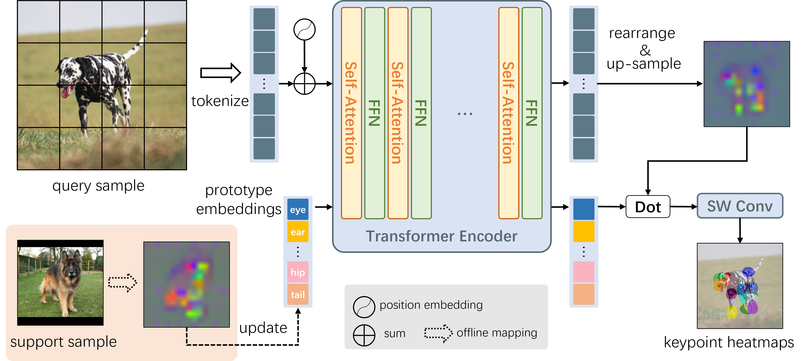

# ProtoPose
Official code repository for the paper: 
[**Effective Category-Agnostic Pose Estimation via Prototype Embeddings**]

<p align="left"></p>

## Main Results
### 1-shot Results on Split1~5
|Set   |PCK@0.05|PCK@0.10|PCK@0.15|PCK@0.20|mPCK |
|------|--------|--------|--------|--------|-----|
|Split1|57.59   |84.38   |91.76   |94.94   |82.17|
|Split2|57.13   |82.58   |89.97   |93.56   |80.81|
|Split3|59.34   |82.55   |88.72   |91.82   |80.61|
|Split4|47.72   |83.92   |92.47   |95.07   |79.79|
|Split5|61.39   |85.85   |91.55   |94.19   |83.25|

### 5-shot Results on Split1~5
|Set   |PCK@0.05|PCK@0.10|PCK@0.15|PCK@0.20|mPCK |
|------|--------|--------|--------|--------|-----|
|Split1|63.21   |88.82   |94.70   |97.00   |85.93|
|Split2|62.45   |86.65   |92.77   |95.48   |84.34|
|Split3|66.77   |87.97   |92.35   |94.60   |85.42|
|Split4|53.35   |89.24   |95.76   |97.40   |83.93|
|Split5|68.23   |90.37   |94.51   |96.31   |87.35|


### 1-shot Results of Cross Super-Category Evaluation (PCK@0.20)
| Human Body | Human Face | Vehicle |Furniture|
|------------|------------|---------|---------|
| 86.91      | 92.25      | 54.53   | 	77.73  |

## Model Zoo
| Backbone | Set              | Download                                                                                              |
|----------|------------------|-------------------------------------------------------------------------------------------------------|
| Vit-Base | Split1           | [Google Drive](https://drive.google.com/file/d/1V25tVkoQpyTPP066viS_o_KVmY1guXVo/view?usp=sharing)    |
| Vit-Base | Split2           | [Google Drive](https://drive.google.com/file/d/1YGRZ5EQqc0jcP_XhYSMfIK0NzgCyoYHI/view?usp=sharing)    |
| Vit-Base | Split3           | [Google Drive](https://drive.google.com/file/d/1QwYrd9PftdfFdvmF9a8WhwBznZ6yXGml/view?usp=sharing)    |
| Vit-Base | Split4           | [Google Drive](https://drive.google.com/file/d/1Sw24usciUREMioNtNlX80hYHmNQayr7r/view?usp=sharing)    |
| Vit-Base | Split5           | [Google Drive](https://drive.google.com/file/d/1_eD4W5Cx-wrSTuZYxuiLMqzARdA8m0M7/view?usp=sharing)    |
| Vit-Base | Corss Human Body | [Google Drive](https://drive.google.com/file/d/1mdM8nzOgZMTiwjn-w_tdN-xa0grqtZVG/view?usp=drive_link) |
| Vit-Base | Corss Human Face | [Google Drive](https://drive.google.com/file/d/1AsmD4lYe6IrPnzh6uS_KZ22p32wBnDIU/view?usp=sharing)    |
| Vit-Base | Corss Vehicle    | [Google Drive](https://drive.google.com/file/d/1-oZs4m4Oo0N2MMwuUeRDJwTX2j80Gini/view?usp=sharing)    |
| Vit-Base | Corss Furniture  | [Google Drive](https://drive.google.com/file/d/1_svl6zQp8UEXp4mwm4pQP6kavZSlW1DP/view?usp=drive_link) |

## Data preparation
Please follow the [official guide](https://github.com/luminxu/Pose-for-Everything) to prepare the MP-100 dataset.
Extract them under ${YOUR_DATA_DIR}, and make them look like this:
```
${YOUR_DATA_DIR}
    |-- mp100
    `-- |-- annotations
        |   |-- mp100_split1_train.json
        |   |-- mp100_split1_val.json
        |   |-- mp100_split1_test.json
        |   |-- ...
        |   |-- mp100_cross_human_body_train.json
        |   |-- mp100_cross_human_body_val.json
        |   |-- ...
        |-- images
        |   |-- alpaca_face
        |   |-- antelope_body
        |   |-- ...
            
```
You can develop a script or download from [Google Drive](https://drive.google.com/file/d/1fH44eMxfdKRjCDNwymvLyMTbb8EiPwBW/view?usp=sharing) to organize annotations files for **Cross Super-Category Evaluation**.

## Quick start
1. Clone this repo.
2. Install dependencies:
   ```
   pip install -r requirements.txt
   ```
3. Download the pre-trained backbone from [DINOv2](https://github.com/facebookresearch/dinov2/tree/main) and place it in the 'pretrained' directory.
4. Training with multiple gpus:

    ```
    python train.py \
        config/vit_base_256x256_mp100_split1_train.py --num_gpus ${NUM_GPUS} --distributed True
    ```
5. Testing with single gpu on test set:

    ```
    python test.py \
        config/vit_base_256x256_mp100_split1_test_fewshot.py ${MODEL PATH} --set test --num_shots 1
    ```    
6. Testing with multiple gpus:

    ```
    python test.py \
        config/vit_base_256x256_mp100_split1_test_fewshot.py ${MODEL PATH} --set test --num_shots 1 --num_gpus ${NUM_GPUS} --distributed True
    ```

## Acknowledgement

Thanks to:

- [MMPose](https://github.com/open-mmlab/mmpose)
- [DINOv2](https://github.com/facebookresearch/dinov2)
- [Pose-for-Everything](https://github.com/luminxu/Pose-for-Everything)

## License

This project is released under the [Apache 2.0 license](LICENSE).
